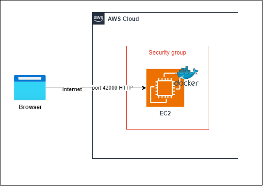
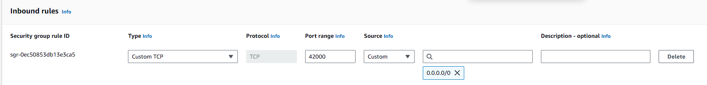
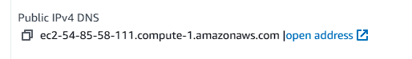
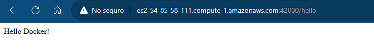

# Spark Web App

This is an example web app using java spark and docker.

# Architecture

The architecture of this project is as follows.



- A EC2 instance running in AWS. This instance has docker up and running to allow services.
- A security group that handle the inbound rules to the EC2 instance. This security group allows traffic in the port 42000 TCP. In this example we are going to use HTTP to view the app content.
- A web browser that requests the page content of the app via the internet.

# Prerequisites

- Docker
- AWS


## How to generate the docker images

The project already has an [Dockerfile](./Dockerfile) with java 17 correto.

Build the docker image

```bash
docker build --tag  docker-spark-web-app .
```

Tag the created image

```bash
docker tag docker-spark-web-app <username>/docker-spark-web-app
```

Push the image to docker hub

```bash
docker push <username>/docker-spark-web-app
```

## Docker installation

In a virtual machine, make sure docker is installed.

Example with Amazon Linux in EC2.

```bash
sudo yum update -y
sudo yum install docker
sudo service docker start
sudo usermod -a -G docker ec2-user
```

## Running the app

In the virtual machine, execute the following command to run the container.

Example of the app running in the port 42000.

```bash
docker run -p 42000:15600 --name docker-spark-web-app-instance <username>/docker-spark-web-app
```

## Openning the EC2 port

In order to see the result, we must allow traffic in EC2 in the port 42000. In the AWS portal, go to your virtual machine, and go to security -> security group -> edit inbound rules.

Allow access to the port 42000 or the port your container is running in.



Save the configuration rule.

## Testing the app

In AWS, find the VM ipv4 DNS.



Open in a new window, in the port 42000, or the port you chose.

Final result.

